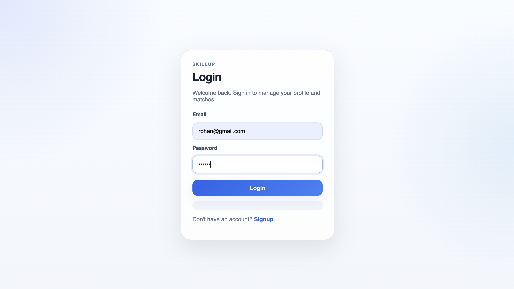
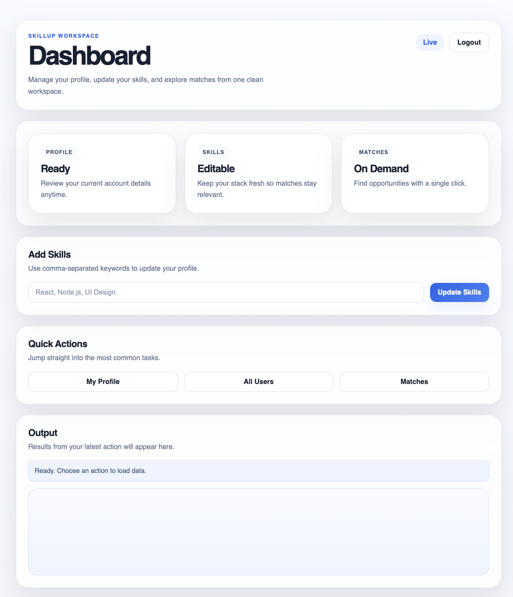
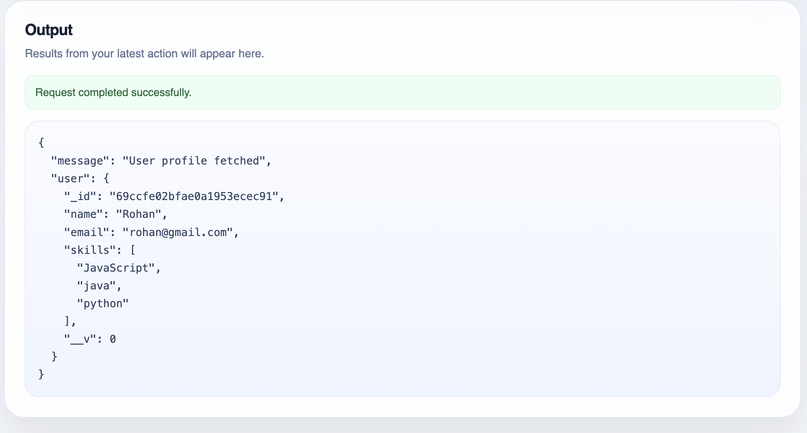
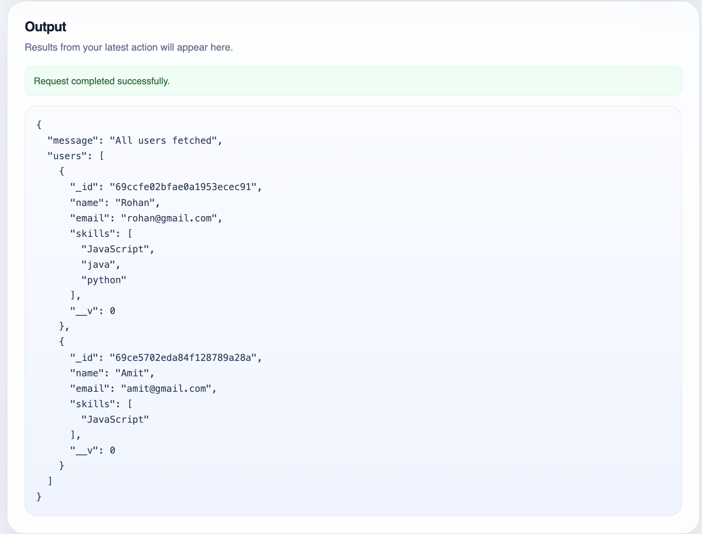
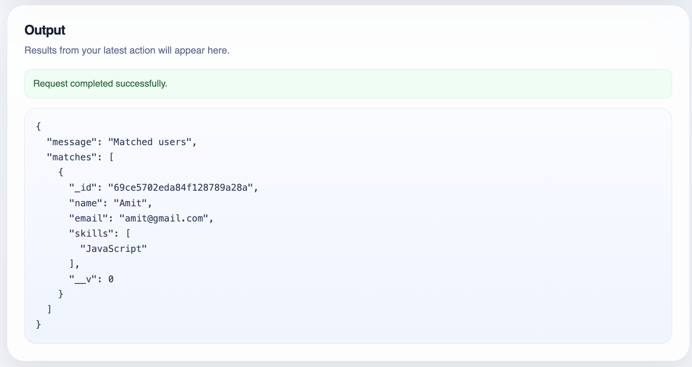

# SkillUp - Skill Matching Platform

## 🚀 Features
- User Signup & Login (JWT Authentication)
- Secure password hashing (bcrypt)
- Profile management
- Skill-based user matching
- Protected routes
- Full-stack integration (Frontend + Backend)

## 🛠 Tech Stack
- Backend: Node.js, Express
- Database: MongoDB
- Frontend: HTML, CSS, JavaScript

## ⚙️ Setup

### Backend
cd backend
npm install
node server.js

### Frontend
Open index.html in browser

## Screenshots

## 📌 Future Improvements
- Chat system
- Better UI/UX
- Skill ranking system
